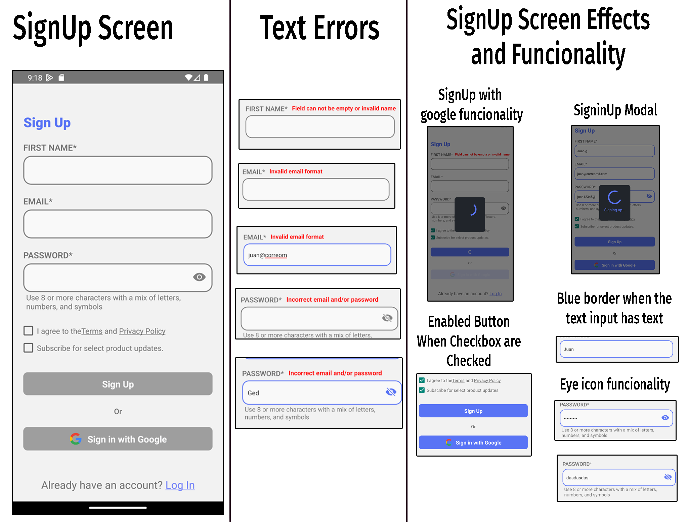
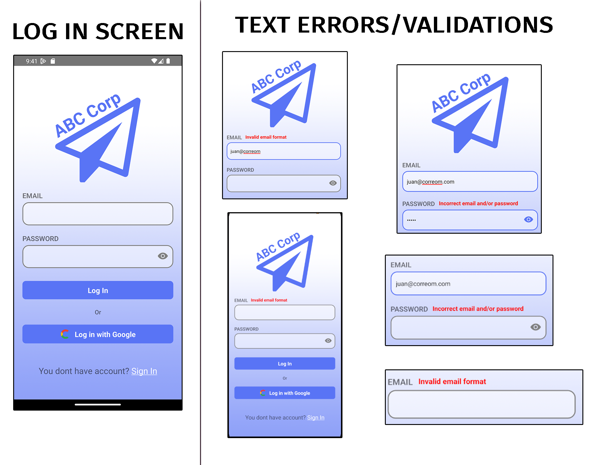
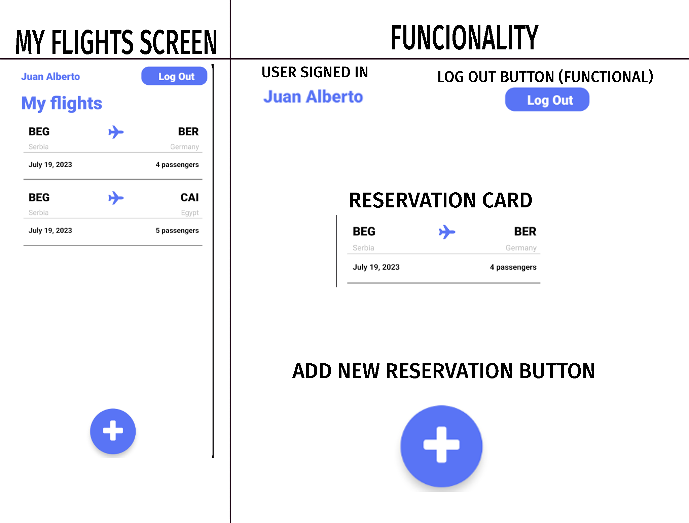
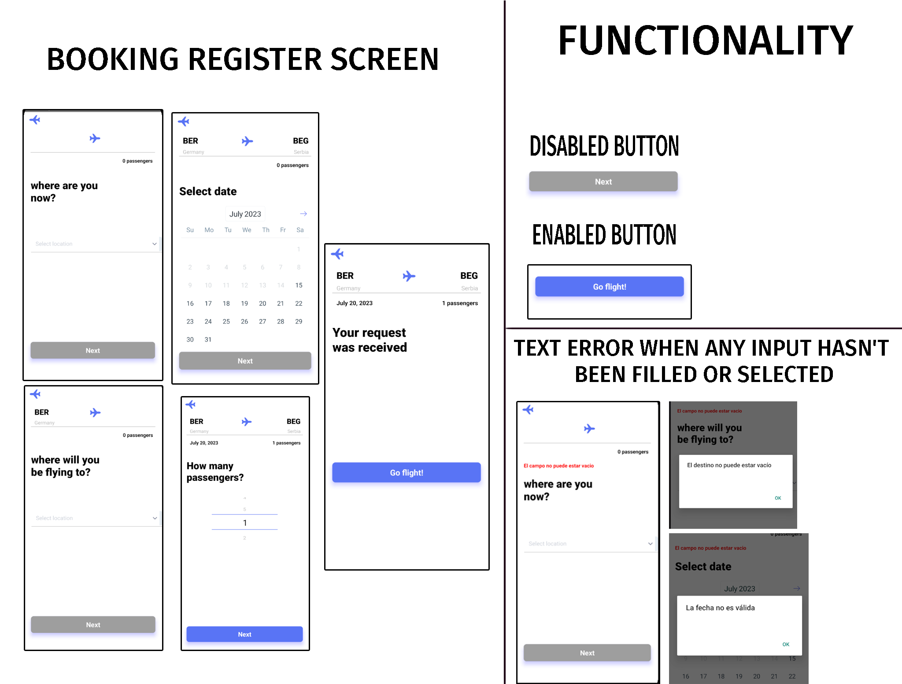

# Flight Booking Challenge - Alfa Buena Maravilla Onda Team

This repository contains the mobile application project for the Flight Booking Challenge of the Alfa Buena Maravilla Onda Team, developed with React Native CLI as part of the training program (bootcamp) at BrightCoders Institute.

## Table of Contents

- [Description](#project-description)
- [Technologies Used](#technologies-used)
- [Screenshots](#screenshots)
- [Development Environment Setup](#development-environment-setup)
- [Credits](#credits)
- [Workspace](#workspace)
- [Contribution](#contribution)
- [Contact](#contact)

## Project Description

The flight booking application aims to provide users with an intuitive and efficient platform for searching, comparing, and booking flights. With this application, users can explore various flight options, including details such as origin, destinations, dates, and passengers.

## Technologies Used

- [React Native](https://reactnative.dev): Framework for mobile application development.
- [Firebase](https://firebase.google.com): Platform for mobile and web application development (Database).
- [JavaScript](https://developer.mozilla.org/es/docs/Web/JavaScript): The programming language used.
- Other specific React Native packages and dependencies detailed in the `package.json` file.

### Features

- User registration and authentication.
- Management of reservations and viewing of history.
- Reservation of selected flights by origin, destination, dates, and other criteria.
- Integration with external services to get updated information about flights and availability.

## Screenshots

## Development Environment Setup

Follow these steps to set up the development environment locally:

1. Clone this repository on your local machine:
   git clone https://github.com/BrightCoders-Institute/reto-reservacion-de-vuelos-equipo-alfa-buena-maravilla-onda

2. Make sure you have Node.js installed on your system. Refer to the official documentation for detailed instructions on installation.

3. Install the project dependencies by running the following command in the root directory of the project:
   npm install

4. Set up your development environment for React Native by following the appropriate instructions for React Native CLI.

5. Run the application on your device/emulator by running the following command:
   npx react-native run-android

npx react-native run-ios

6. The application will start on your device/emulator.

## Credits

- [BrandonVG](https://github.com/BrandonVG)
- [Axw3ll](https://github.com/Axw3ll)
- [Tole15](https://github.com/Tole15)

## Workspace

We have a workspace in Gather.town, where you can collaborate and communicate with the team. You can access the workspace here: [Campus Zeffo](https://app.gather.town/app/Xqjd4OwO4fzoQAHV/campus-zeffo).

## Contribution

If you want to contribute to this project, follow these steps:

1. Fork this repository and clone it on your local machine.

2. Create a new branch for your contribution:
   git checkout -b feature/new-feature

3. Make your modifications and improvements.

4. Be sure to run existing tests and add new tests for your changes.

5. Commit your changes:
   git commit -m "Add new feature"

6. Push your changes to your remote repository:
   git push origin feature/new-feature

7. Create a pull request in this repository and describe your changes in detail.

The development team will review your request and provide feedback as soon as possible.

## Contact

If you have any questions or suggestions about the project, feel free to contact us through our provided github above or by visiting our collaborative space in Gather.town: [Campus Zeffo](https://app.gather.town/app/Xqjd4OwO4fzoQAHV/campus-zeffo).
